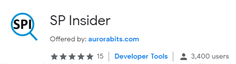
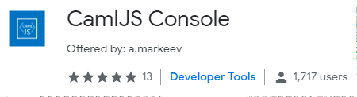
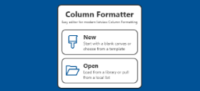
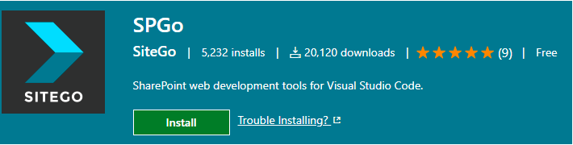

# SharePoint produtivity tools

List of popular productivity tools for SharePoint.

---
## List of Tools:

| Name | Image | Description
| ---- | ----- | ------------------ |
| [FlyView](https://chrome.google.com/webstore/detail/flyview-for-sharepoint-an/blmfdjjomajmejdkdbcabhgfonkhfaam) |  | Explore SharePoint sites with this super-fast SharePoint navigation plugin, supports SharePoint Online (Office 365) and on-premises
| [SP Insider](https://chrome.google.com/webstore/detail/sp-insider/gjckpigahcbffmeofjfedlffddhfidhj?hl=en) |  | SP Insider (SPI) for Chrome is a free SharePoint Discovery tool for Developers and supports SharePoint Online/Office 365, 2016 and 2013. |
| [Cisar](https://chrome.google.com/webstore/detail/cisar/nifbdojdggkboiifaklkamfpjcmgafpo?hl=en) |  | SharePoint CSR Live Edit. It makes process of creating SharePoint Client Side Rendering customizations many times faster. The customizations will be applied as-you-type to the underlying SharePoint page.  |
| [Caml JS Console](https://chrome.google.com/webstore/detail/camljs-console/ohjcpmdjfihchfhkmimcbklhjdphoeac?hl=en) |  | CamlJS Console with live preview. Free and open source development console for creating SharePoint CAML queries, with live preview against real lists and libraries. Uses CamlJs syntax. |
| [SP Editor](https://chrome.google.com/webstore/detail/sp-editor/ecblfcmjnbbgaojblcpmjoamegpbodhd?hl=en) |  | This tool will help you create amazing SharePoint applications fast from your browser from any computer which runs Chrome! |
| [Column formatter](https://github.com/SharePoint/sp-dev-solutions/tree/master/solutions/ColumnFormatter) |  | SPFx webpart. Full power of VS Code editing while providing easy to use templates and wizards all within the browser! The goal is to make writing and applying Column Formatting easier and quicker for both developers and end users. |
| [SP Go](https://marketplace.visualstudio.com/items?itemName=SiteGo.spgo) |  | VS Code extension. Develop SharePoint web solutions from your local PC using the power of Visual Studio Code. Now you can build SharePoint sites and customizations source-control first with all of the power of a top-tier IDE. Produce cleaner code, deliver faster. | 
| [ModHeader](https://chrome.google.com/webstore/detail/modheader/idgpnmonknjnojddfkpgkljpfnnfcklj?hl=en) |   | Chrome extension. Use it to inject `Accept: application/json;odata=verbose` header. Forces SharePoint REST endpoints to return JSON instead of XML. Use it together with the [JSON Viewer](https://chrome.google.com/webstore/detail/json-viewer/gbmdgpbipfallnflgajpaliibnhdgobh) extension for the best effect.   |
| [JSON Viewer](https://chrome.google.com/webstore/detail/json-viewer/gbmdgpbipfallnflgajpaliibnhdgobh)  |  | Chrome extension. The most beautiful and customizable JSON/JSONP highlighter that your eyes have ever seen |

Sample scripts and files are also includes in the [/scripts/ folder](/scripts/).