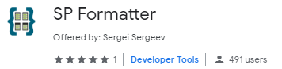
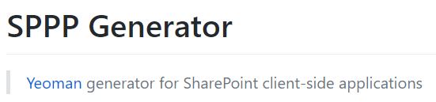
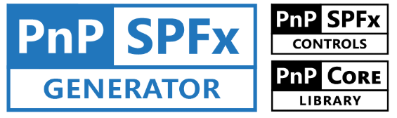
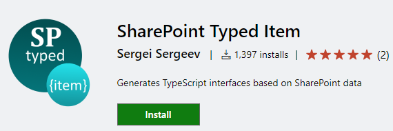
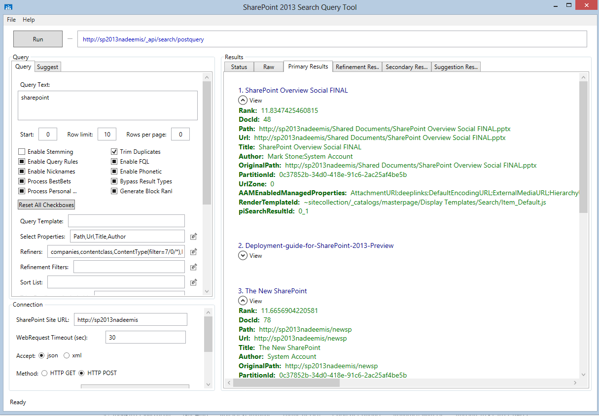
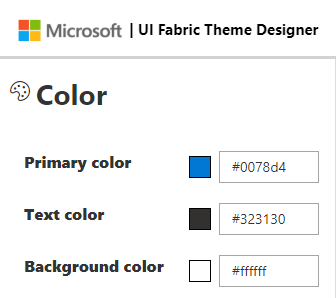
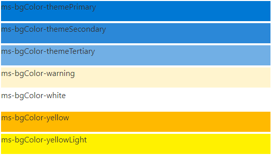
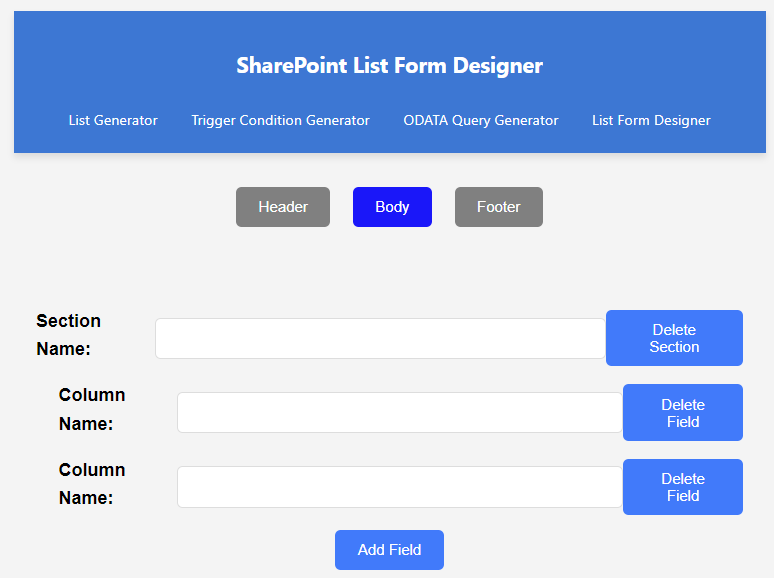
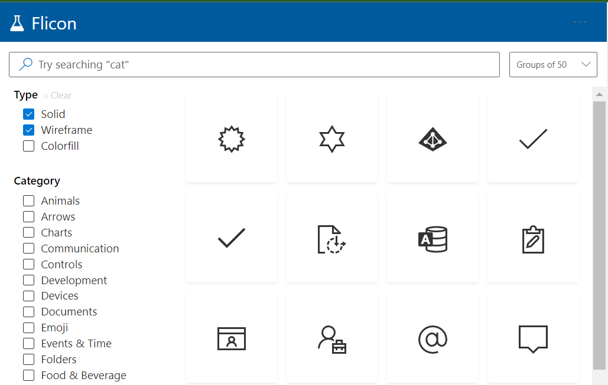

# SharePoint productivity tools

List of popular productivity tools for SharePoint.

# List of Free Tools

Sample scripts and files are also included in the [/scripts/ folder](/scripts/).

## Chrome extensions
| Name | Image | Description
| ---- | ----- | ------------------ |
| [FlyView](https://chrome.google.com/webstore/detail/flyview-for-sharepoint-an/blmfdjjomajmejdkdbcabhgfonkhfaam) |  | Explore SharePoint sites with this super-fast SharePoint navigation plugin, supports SharePoint Online (Office 365) and on-premises
| [SP Insider](https://chrome.google.com/webstore/detail/sp-insider/gjckpigahcbffmeofjfedlffddhfidhj?hl=en) |  | SP Insider (SPI) for Chrome is a free SharePoint Discovery tool for Developers and supports SharePoint Online/Office 365, 2016 and 2013. |
| [Cisar](https://chrome.google.com/webstore/detail/cisar/nifbdojdggkboiifaklkamfpjcmgafpo?hl=en) |  | SharePoint CSR Live Edit. It makes process of creating SharePoint Client Side Rendering customizations many times faster. The customizations will be applied as-you-type to the underlying SharePoint page.  |
| [Caml JS Console](https://chrome.google.com/webstore/detail/camljs-console/ohjcpmdjfihchfhkmimcbklhjdphoeac?hl=en) |  | CamlJS Console with live preview. Free and open source development console for creating SharePoint CAML queries, with live preview against real lists and libraries. Uses CamlJs syntax. |
| [SP Editor](https://chrome.google.com/webstore/detail/sp-editor/ecblfcmjnbbgaojblcpmjoamegpbodhd?hl=en) |  | This tool will help you create amazing SharePoint applications fast from your browser from any computer which runs Chrome! |
| [SP Formatter](https://chrome.google.com/webstore/detail/sp-formatter/fmeihfaddhdkoogipahfcjlicglflkhg?hl=en) |  | Chrome extension. Customize your SharePoint Column or View Formatting JSON using full-featured editor instead of default one.  |
| [ModHeader](https://chrome.google.com/webstore/detail/modheader/idgpnmonknjnojddfkpgkljpfnnfcklj?hl=en) |   | Chrome extension. Use it to inject `Accept: application/json;odata=verbose` header. Forces SharePoint REST endpoints to return JSON instead of XML. Use it together with the [JSON Viewer](https://chrome.google.com/webstore/detail/json-viewer/gbmdgpbipfallnflgajpaliibnhdgobh) extension for the best effect.   |
| [JSON Viewer](https://chrome.google.com/webstore/detail/json-viewer/gbmdgpbipfallnflgajpaliibnhdgobh)  |  | Chrome extension. The most beautiful and customizable JSON/JSONP highlighter that your eyes have ever seen |

## SPFx webparts
| Name | Image | Description
| ---- | ----- | ------------------ |
| [Column formatter](https://github.com/SharePoint/sp-dev-solutions/tree/master/solutions/ColumnFormatter) |  | SPFx webpart. Full power of VS Code editing while providing easy to use templates and wizards all within the browser! The goal is to make writing and applying Column Formatting easier and quicker for both developers and end users. |

## Yeoman generators
| Name | Image | Description
| ---- | ----- | ------------------ |
| [SPPP Generator](https://github.com/koltyakov/generator-sppp) |  | Yeoman generator for SharePoint - lets you quickly set up a project with sensible defaults for pulling and pushing files between SharePoint asset library and local projects sources. | 
| [PnP SPFx generator](https://github.com/pnp/generator-spfx) |  | This Yeoman generator provides improved governance for SharePoint Framework projects. It extends the out of the box Yeoman generator from Microsoft (@microsoft/generator-sharepoint) with recommended patterns and additional capabilities. | 

## VS Code plugins
| Name | Image | Description
| ---- | ----- | ------------------ |
| [SP Go](https://marketplace.visualstudio.com/items?itemName=SiteGo.spgo) |  | VS Code extension. Develop SharePoint web solutions from your local PC using the power of Visual Studio Code. Now you can build SharePoint sites and customizations source-control first with all of the power of a top-tier IDE. Produce cleaner code, deliver faster. | 
| [SharePoint Typed Item](https://marketplace.visualstudio.com/items?itemName=s-kainet.sharepoint-typed-item) |  | VS Code extension. Generates TypeScript interfaces based on SharePoint data. A high quality, must-have extension developed by Sergei Sergeev. Quote from one of the users: "I followed the configuration steps and managed to get the extension working in a matter of minutes, having the ability to read/build the types directly from SharePoint.WOW, what a timesaver!!!!!!!!" | 

## Windows apps
| Name | Image | Description
| ---- | ----- | ------------------ |
| [SharePoint Search Query Tool](https://github.com/SharePoint/PnP-Tools/tree/master/Solutions/SharePoint.Search.QueryTool) |  | Learn how to build an HTTP POST query, and how the different parameters should be formatted. | 

## Online apps

| Name | Image | Description
| ---- | ----- | ------------------ |
| [UI Fabric Theme Designer](https://fabricweb.z5.web.core.windows.net/pr-deploy-site/refs/pull/8933/merge/theming-designer/index.html) | | By far the best way to generate modern Theme for SharePoint Online | 
| [Reusable SPO CSS classess](https://zerg00s.github.io/sp-modern-classes) |  | Reusable SharePoint Online CSS Classess for Modern UI. You can use it to develop column formatting customizations or your custom SPFx webparts. |
| [SharePoint List Form Designer](https://form.challigan.com) |  | If you wish to customize the aesthetic of your SharePoint form without the usage of Power Apps, color coordination, icons, form field sections, and a footer can be added with ease. There is a free tool created by Carl Halligan that offers a visual demonstration of this process, which can be found at  https://form.challigan.com |
| [SharePoint Site Designer](https://www.sitedesigner.io) |  | Visual browser-based tool by [David Go](https://github.com/site) for creating site scripts. This tool is amazing and really makes site scripts more accessible. |
| [List Formatting Samples](https://pnp.github.io/List-Formatting)| | You can use List Formatting to customize how fields and views in SharePoint lists and libraries are displayed. List Formatting is applied by constructing a JSON object that describes the elements that are displayed for a field or view and the styles to be applied to those elements. |
| [HTML To Formatter](https://pnp.github.io/List-Formatting/tools/html-formatter-generator/)|  |  Most developers are used to writing HTML rather than JSON. This tool can help building a formatter from a given HTML. You can even put in some CSS to get inline styles populated. This tool does not recognize expressions, but you can write expression strings in place of any attribute value and it will be put as-is on the generated JSON.
| [Flicon - Fluent UI Icon Search](https://www.flicon.io)|  |  This tool is using icons from @fluentui
The set of icons is always growing. 
| [SharePoint look book](https://lookbook.microsoft.com/#templates)|  | Discover the modern experiences you can build with SharePoint in Microsoft 365.

### Which tools should I use?

| Old tool | Suggested alternative |
| -------- | --------------------- |
| SharePoint Designer 2013 | SP Editor, SP Go, SPPP Generator  |
| SharePoint Manager 2013 | SP Insider |
| U2U Caml builder| Caml JS Console |

## Even more awesome tools
### Ultimate Developer Tool List for SPFx

[Ultimate Developer Tool List for SPFx](https://tahoeninjas.blog/2019/03/14/ultimate-developer-tool-list-for-spfx/). Fantastic list of productivity tools by [Hugo Bernier, @bernierh](https://twitter.com/bernierh?lang=en).

### Other 
[Other, non-SharePoint tools](more-tools/RAEDME.md)
