# Instrcutions: Creating an Azure function that is called from SharePoint list.


## Important warning: Azure function V2 does not support SharePoint CSOM.

Azure functions V2 use .net core that is not compatible with SharePoint CSOM libraries. This is why we need to make sure Azure function is using the older, V1 version.

You can only change the runtime version to V1 after you create your function app but before you add any functions. To learn how to pin the runtime version to 1.x, see [View and update the current runtime version](https://docs.microsoft.com/en-us/azure/azure-functions/set-runtime-version#view-and-update-the-current-runtime-version).

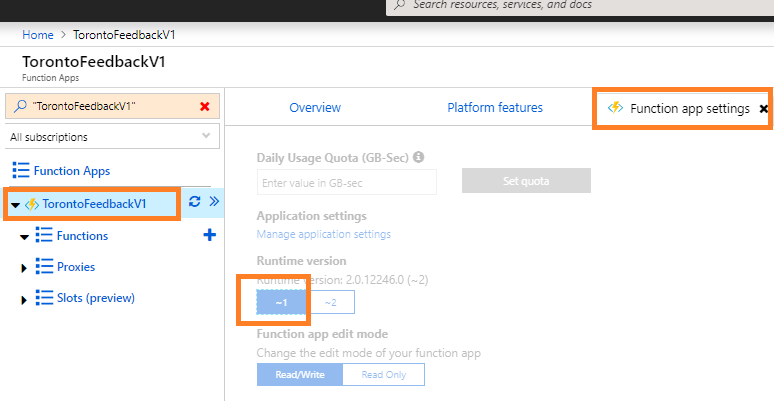


## About creating azure functions. 

Remember to switch your Azure Function App to V1.
- [How to create a SharePoint webhook that will call an Azure function](https://docs.microsoft.com/en-us/sharepoint/dev/apis/webhooks/sharepoint-webhooks-using-azure-functions)
- [Azure function that creates  SharePoint List items via CSOM](https://social.technet.microsoft.com/wiki/contents/articles/38062.sharepoint-online-simulate-sharepoint-timer-jobs-and-event-receivers-using-azure-functions-and-sharepoint-webhooks.aspx)


## Storing Azure Function's secrepts in the application settings

- Navigate to the Azure Function App's Application settings.
- Add any secrets you need. In our case, we added Login and Password:

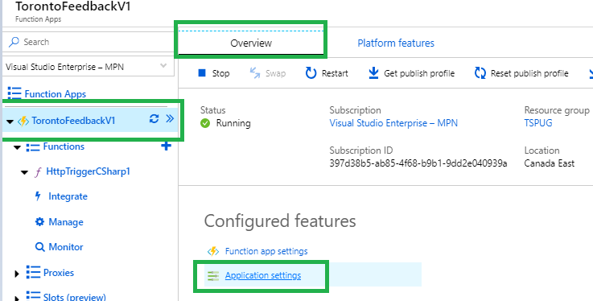

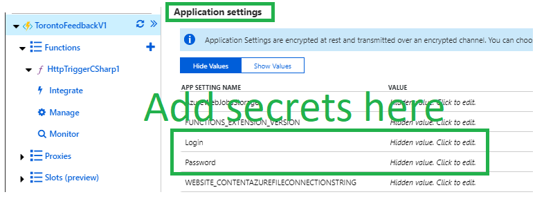

Now you can access your secrets from your C# Azurure Function:
```cs
// Helper method for retrieving the app secrets
public static string GetEnvironmentVariable(string name)
{
    return  System.Environment.GetEnvironmentVariable(name, EnvironmentVariableTarget.Process);
}

// Retrieve app secrets:
string login = GetEnvironmentVariable("Login");
string password = GetEnvironmentVariable("Password");
```


## Upload SharePoint CSOM libraries to Azure function
In order to use SharePoint CSOM libraries from Azure functions, you need need to 
- Use Azure Function App V1 model
- Upload CSOM client libraries to your Azure function:

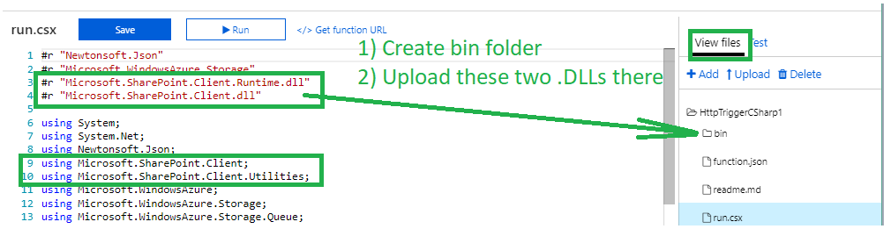

### Uploading CSOM libraries using Kudu tool

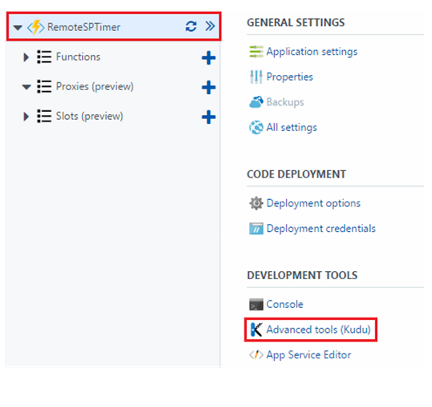


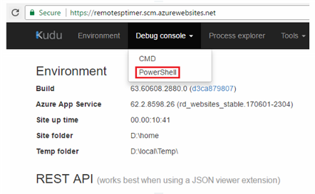


It will open the folder structure. We must navigate to the site –> wwwroot –> <Function Name> location


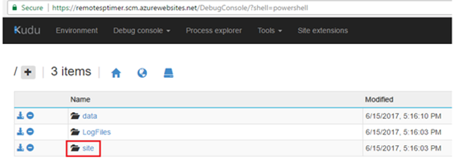

In this case, function name is `ExpiredSLAIdenitifier`. Click on the folder to go inside the folder where we will create a new `\bin` folder.

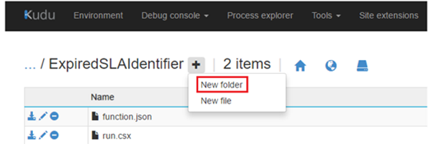

For SharePoint operations, Microsoft.SharePoint.Client.dll and Microsoft.SharePoint.Client.Runtime.dll files are required. Simply drag and drop these .dll's to the `\bin` folder:


images/csomDll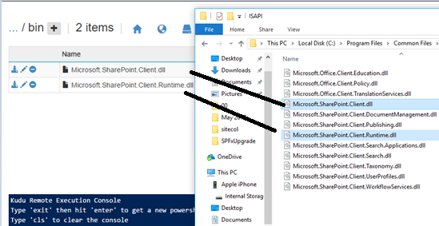


## Sample Azure function code that uses CSOM to create SharePoint list items
```cs
#r "Newtonsoft.Json"
#r "Microsoft.WindowsAzure.Storage"
#r "Microsoft.SharePoint.Client.Runtime.dll" 
#r "Microsoft.SharePoint.Client.dll"

using System;
using System.Net;
using Newtonsoft.Json;
using Microsoft.SharePoint.Client;
using Microsoft.SharePoint.Client.Utilities;
using Microsoft.WindowsAzure;
using Microsoft.WindowsAzure.Storage;
using Microsoft.WindowsAzure.Storage.Queue;
public static async Task<object> Run(HttpRequestMessage req, ILogger log)
{
    //log.LogInformation($"Webhook was triggered!");
    //await ConnectToSharePointAndSendEmail(log);
    string validationToken = req.GetQueryNameValuePairs().FirstOrDefault(q Instrcutions to create an Azure function=> string.Compare(q.Key, "validationtoken", true) == 0).Value; 
    string message = req.GetQueryNameValuePairs().FirstOrDefault(q => string.Compare(q.Key, "message", true) == 0).Value;

    // This is just for registration:
    if (validationToken != null)
    {
        await ConnectToSharePointAndAddListItem(log, "webhook registered! " + message);
        log.LogInformation($"Validation token {validationToken} received");
        var response = req.CreateResponse(HttpStatusCode.OK);
        response.Content = new StringContent(validationToken);
        return response;
    }
    // this is for normal runs:
    var content = await req.Content.ReadAsStringAsync();
    log.LogInformation($"Received payload: {content}");
    await ConnectToSharePointAndAddListItem(log, message);
    return new HttpResponseMessage(HttpStatusCode.OK);
}
public static async Task<bool> ConnectToSharePointAndAddListItem(ILogger log, string message)
{
    string password = GetEnvironmentVariable("Password");
    string login = GetEnvironmentVariable("Login");
    System.Security.SecureString securePassword = new System.Security.SecureString();
    foreach (char pass in password)
    {
        securePassword.AppendChar(pass);
    }
    SharePointOnlineCredentials spOnlineCredentials = new SharePointOnlineCredentials(login, securePassword);
    try
    {
        log.LogInformation($"Conneciton to SharePoint...");
        using (var SPClientContext = new ClientContext("https://zergs.sharepoint.com/sites/demo"))
        {
            log.LogInformation($"[Success] Connected to SharePoint");
            SPClientContext.Credentials = spOnlineCredentials;
            Web spWeb = SPClientContext.Site.RootWeb;
            List spList = spWeb.Lists.GetByTitle("AzureLog");
            SPClientContext.Load(spList);
            SPClientContext.ExecuteQuery();           
            log.LogInformation($"[Success] spList items: {spList.Title}");

            
            ListItemCreationInformation itemCreateInfo = new ListItemCreationInformation();
            ListItem oListItem = spList.AddItem(itemCreateInfo);
            oListItem["Title"] = message + " | " + DateTime.UtcNow.ToLongTimeString();

            oListItem.Update();
            SPClientContext.ExecuteQuery();


        }
    }
    catch (Exception ex)
    {
        log.LogInformation($"Azure Function Exception: {ex.Message}");
    }
    return true;
}


public static string GetEnvironmentVariable(string name)
{
    return  System.Environment.GetEnvironmentVariable(name, EnvironmentVariableTarget.Process);
}

```


## Register web hook using SP Editor
- Click on Get function URL:
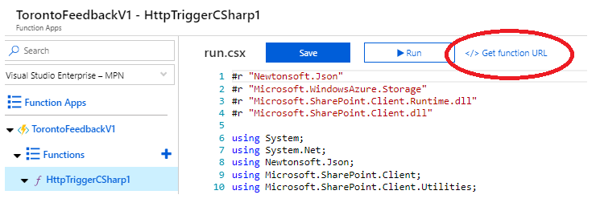
- Open SharePoint site
- Click F12
- Click on the "SharePoint" tab
- Webhooks
- Select SharePoint list you want to use. It will automatically call your Azure function every time thee is a change in the list
- Paste the Azure function URL and press Add:

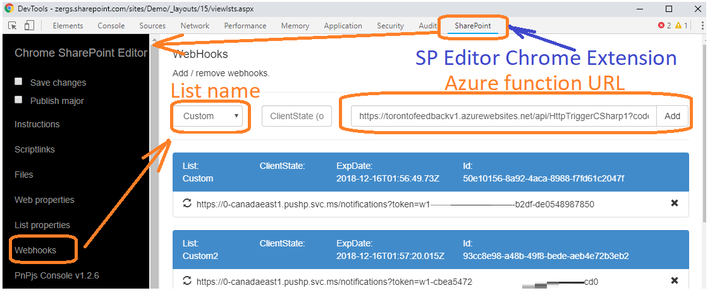
