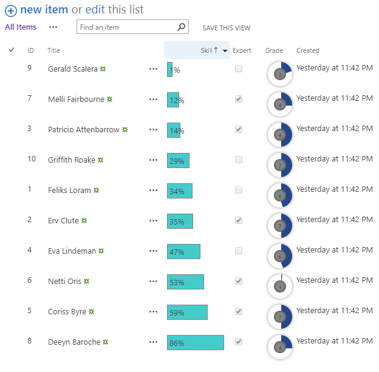

# Cisar. Chrome extension. Samples and code snippets 



### Styling the list view form using JSLink and Cisar
```js
SP.SOD.executeFunc("clienttemplates.js", "SPClientTemplates", function () {

    function getBaseHtml(ctx) {
        return SPClientTemplates["_defaultTemplates"].Fields.default.all.all[ctx.CurrentFieldSchema.FieldType][ctx.BaseViewID](ctx);
    }
    function init() {
        SPClientTemplates.TemplateManager.RegisterTemplateOverrides({
            Templates: {
                Fields: {
                    "Skill": {
                        View: function (ctx) {
                            return `<div style='border:solid 1px grey;background-color:#0CC; padding:3px; width:${ctx.CurrentItem[ctx.CurrentFieldSchema.Name]}px'>${ctx.CurrentItem[ctx.CurrentFieldSchema.Name]}% </div> `
                        }
                    },
                    "Grade": {
                        View: function (ctx) {
                          	
                            return `<div class='pieContainer'><div class='pieBackground'></div><div id='pieSlice${ctx.CurrentItem[ctx.CurrentFieldSchema.Name]}' class='hold'><div class='pie'></div></div><div class='innerCircle'><div class='content'>${ctx.CurrentItem[ctx.CurrentFieldSchema.Name]}</div></div></div> `
                        },
                    },
                    "Expert": {
                        View: function (ctx) {
                          if (ctx.CurrentItem[ctx.CurrentFieldSchema.Name] === 'Yes'){
                            return `<input type='checkbox' checked disabled>`
                          }else{
                            return `<input type='checkbox' disabled>`
                          }

                        },
                    }
                },
            },
            ListTemplateType: 100
        });
    }

    RegisterModuleInit(SPClientTemplates.Utility.ReplaceUrlTokens("~siteCollection/Style Library/Users.js"), init);
    init();

});


```

### Styling the pie charts:

```css
.pieContainer {
    height: 40px;
    margin-left: 5px;
    position: relative;
  }
  
  .pieBackground {
    position: absolute;
    width: 40px;
    height: 40px;
    border-radius: 20px;
    box-shadow: 0px 0px 8px rgba(0,0,0,0.5);
  } 
  
  .pie {
    transition: all 1s;
    position: absolute;
    width: 40px;
    height: 40px;
    border-radius: 22px;
    clip: rect(0px, 22px, 40px, 0px);
  }
  
  .hold {
    position: absolute;
    width: 40px;
    height: 40px;
    border-radius: 22px;
    clip: rect(0px, 40px, 40px, 22px);
  }
  
  #pieSlice1 .pie {
    background-color: #1b458b;
    transform:rotate(5deg);
  }
  
  #pieSlice2 .pie {
    background-color: #1b458b;
    transform:rotate(50deg);
  }
  
  #pieSlice3 .pie {
    background-color: #1b458b;
    transform:rotate(70deg);
  }
  #pieSlice4 .pie {
    background-color: #1b458b;
    transform:rotate(90deg);
  }
  #pieSlice5 .pie {
    background-color: #1b458b;
    transform:rotate(120deg);
  }
  #pieSlice6 .pie {
    background-color: #1b458b;
    transform:rotate(160deg);
  }
  #pieSlice7 .pie {
    background-color: #1b458b;
    transform:rotate(180deg);
  }
  #pieSlice8 .pie {
    background-color: #1b458b;
    transform:rotate(180deg);
  }
  #pieSlice9 .pie {
    background-color: #1b458b;
    transform:rotate(180deg);
  }
  
  
  .innerCircle {
    position: absolute;
    width: 20px;
    height: 20px;
    background-color: #888;
    border-radius: 30px;
    top: 10px;
    left: 10px; 
    box-shadow: 0px 0px 8px rgba(0,0,0,0.5) inset;
    color: white;
  }
  .innerCircle .content {
    position: absolute;
    display: block;
    width: 20px;
    top: 5px;
    left: 0;
    text-align: center;
    font-size: 8px;
    color: black
  }
  
  
```