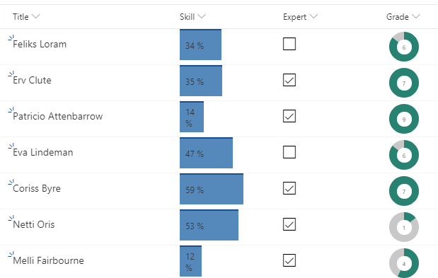

# [Column formatter](https://github.com/SharePoint/sp-dev-solutions/tree/master/solutions/ColumnFormatter). Samples and code snippets 





### Skill - bar chart
```json
{
  "$schema": "http://columnformatting.sharepointpnp.com/columnFormattingSchema.json",
  "elmType": "div",
  "txtContent": {
    "operator": "+",
    "operands": [
      {
        "operator": "toString()",
        "operands": [
          {
            "operator": "*",
            "operands": [
              1,
              {
                "operator": "-",
                "operands":[
                  "@currentField",
                 0
                ]
              }
            ]
          }
        ]
      },
      " %"
    ]
  },
  "attributes": {
    "class": "sp-field-dataBars"
  },
  "style": {
    "width": {
      "operator": "?",
      "operands": [
        {
          "operator": ">",
          "operands": [
            "@currentField",
            100
          ]
        },
        "100%",
        {
          "operator": "?",
          "operands": [
            {
              "operator": "<",
              "operands": [
                "@currentField",
                0
              ]
            },
            "0",
            {
              "operator": "+",
              "operands": [
                {
                  "operator": "toString()",
                  "operands": [
                    {
                      "operator": "*",
                      "operands": [
                        1,
                        {
                          "operator": "-",
                          "operands":[
                            "@currentField",
                            0
                          ]
                        }
                      ]
                    }
                  ]
                },
                "%"
              ]
            }
          ]
        }
      ]
    }
  }
}
```

###  Exporet: yes/no column

```json
{
  "$schema": "http://columnformatting.sharepointpnp.com/columnFormattingSchema.json",
  "elmType": "div",
  "attributes": {
    "iconName": {
      "operator": "?",
      "operands": [
        "@currentField",
        "CheckboxComposite",
        "Checkbox"
      ]
    }
  },
  "style": {
    "font-size":"large",
    "color":"black"
  }
}

```

### Grade: pie chart
```json
{
  "$schema": "http://columnformatting.sharepointpnp.com/columnFormattingSchema.json",
  "elmType": "div",
  "style": {
    "padding": "4px",
    "height": "42px",
    "width": "42px"
  },
  "children": [
    {
      "elmType": "div",
      "style": {
        "display": "inline-block",
        "background-color": "#c8c8c8",
        "border-radius": "100%",
        "fill": "#008272",
        "width": "42px",
        "height": "42px",
        "position": "absolute"
      },
      "children": [
        {
          "elmType": "svg",
          "children": [
            {
              "elmType": "path",
              "attributes": {
                "d": {
                  "operator": "+",
                  "operands": [
                    "M21,21 L21,0, A21,21 0 ",
                    {
                      "operator": ":",
                      "operands": [
                        {
                          "operator": "<=",
                          "operands": [
                            "@currentField",
                            3.5
                          ]
                        },
                        "0",
                        "1"
                      ]
                    },
                    ",1 ",
                    {
                      "operator": "toString()",
                      "operands": [
                        {
                          "operator": "+",
                          "operands": [
                            21,
                            {
                              "operator": "*",
                              "operands": [
                                {
                                  "operator": "sin",
                                  "operands": [
                                    {
                                      "operator": "*",
                                      "operands": [
                                        6.2831853,
                                        {
                                          "operator": "/",
                                          "operands": [
                                            {
                                              "operator": "-",
                                              "operands": [
                                                {
                                                  "operator": "?",
                                                  "operands": [
                                                    {
                                                      "operator": ">=",
                                                      "operands": [
                                                        "@currentField",
                                                        7
                                                      ]
                                                    },
                                                    6.9999,
                                                    {
                                                      "operator": "?",
                                                      "operands": [
                                                        {
                                                          "operator": "<",
                                                          "operands": [
                                                            "@currentField",
                                                            0
                                                          ]
                                                        },
                                                        0,
                                                        "@currentField"
                                                      ]
                                                    }
                                                  ]
                                                },
                                                0
                                              ]
                                            },
                                            7
                                          ]
                                        }
                                      ]
                                    }
                                  ]
                                },
                                21
                              ]
                            }
                          ]
                        }
                      ]
                    },
                    ",",
                    {
                      "operator": "toString()",
                      "operands": [
                        {
                          "operator": "-",
                          "operands": [
                            21,
                            {
                              "operator": "*",
                              "operands": [
                                {
                                  "operator": "cos",
                                  "operands": [
                                    {
                                      "operator": "*",
                                      "operands": [
                                        6.2831853,
                                        {
                                          "operator": "/",
                                          "operands": [
                                            {
                                              "operator": "-",
                                              "operands": [
                                                {
                                                  "operator": "?",
                                                  "operands": [
                                                    {
                                                      "operator": ">=",
                                                      "operands": [
                                                        "@currentField",
                                                        7
                                                      ]
                                                    },
                                                    6.9999,
                                                    {
                                                      "operator": "?",
                                                      "operands": [
                                                        {
                                                          "operator": "<",
                                                          "operands": [
                                                            "@currentField",
                                                            0
                                                          ]
                                                        },
                                                        0,
                                                        "@currentField"
                                                      ]
                                                    }
                                                  ]
                                                },
                                                0
                                              ]
                                            },
                                            7
                                          ]
                                        }
                                      ]
                                    }
                                  ]
                                },
                                21
                              ]
                            }
                          ]
                        }
                      ]
                    },
                    " z"
                  ]
                }
              }
            }
          ]
        }
      ]
    },
    {
      "elmType": "div",
      "style": {
        "background-color": "white",
        "position": "relative",
        "width": "21px",
        "height": "21px",
        "top": "0px",
        "left": "10.5px",
        "border-radius": "100%",
        "text-align": "center"
      },
      "children": [
        {
          "elmType": "div",
          "txtContent": "@currentField",
          "style": {
            "position": "relative",
            "text-align": "center",
            "width": "42px",
            "display": "inline",
            "line-height":"21px",
            "font-size":"8.4px"
          }
        }
      ]
    }
  ]
}

```